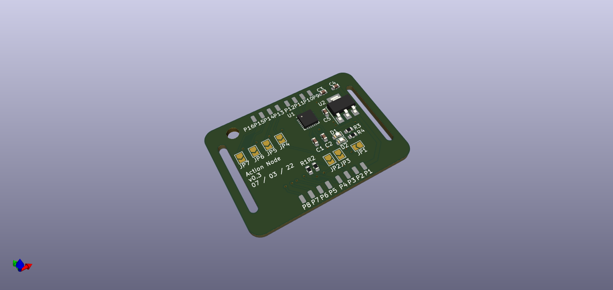
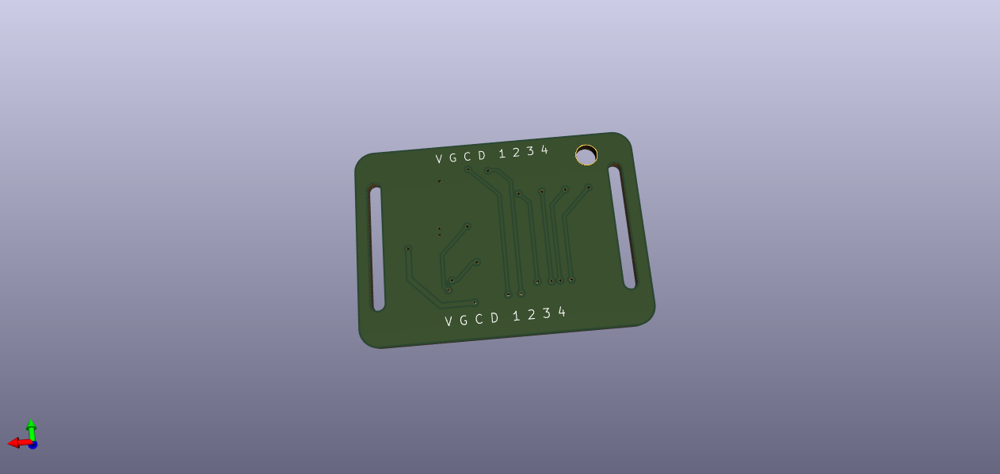

# Action Tracer Node
This repository supports the Action Tracer project which I undertook as part of my Masters Dissertation at the University of Cape Town in 2021 - 2022.

## What is Action Tracer?
This project aims to create a motion capture system based on the MPU-6050 IMU. This system is powered by a Raspberry Pi Zero W, which collects, processes and sends data, in real time, to a users device. 

Action Tracer differs from most systes due to its use of a 6-axes IMU and it's promise to deliver 30 frames per second with minimal latency over a Wi-Fi network. 

To see more on this project, please visit the main repository: [Action Tracer](https://github.com/chirambaht/Action-Tracer).
## Why a node?
To monitor each articulating joint, an IMU needs to be placed near by to capture its rotation. To help this, the design houses two 20mm wide slots that allow a strap to go through it and strap it to the area it is montoring. At this stage, this design shows a wired node but future plans involve turning this node wireless. One such implementation of this was attempted and can be found here: [Wireless Action Node](https://github.com/chirambaht/WirelessAction).
## Bill of Materials
| Comment     | Designator | Footprint                      | LCSC   |
|-------------|------------|--------------------------------|--------|
| 0.1u        | C2,C5      | C_0603_1608Metric              | C14663 |
| 2.2n        | C3         | C_0603_1608Metric              | C1604  |
| 0.33u       | C4         | C_0603_1608Metric              | C1615  |
| Power       | D1,D2      | LED_0603_1608Metric            | C2286  |
| MPU-6050    | U1         | InvenSense_QFN-24_4x4mm_P0.5mm | C24112 |
| 10k         | R1,R2      | R_0603_1608Metric              | C25804 |
| 68          | R3,R4      | R_0603_1608Metric              | C27592 |
| 10n         | C1         | C_0603_1608Metric              | C57112 |
| AMS1117-3.3 | U2         | SOT-223-3_TabPin2              | C6186  |
## Images

A picture showing the front of the board. This will hold all the components used in this project. 

The rear side of the board with markings for each of the connector lines, showing where they should be placed.
## Tools
This board was designed in KiCad 6.0.